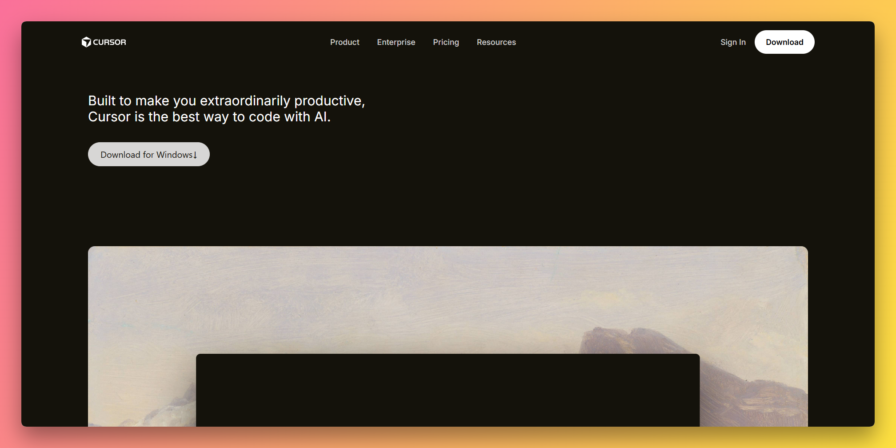
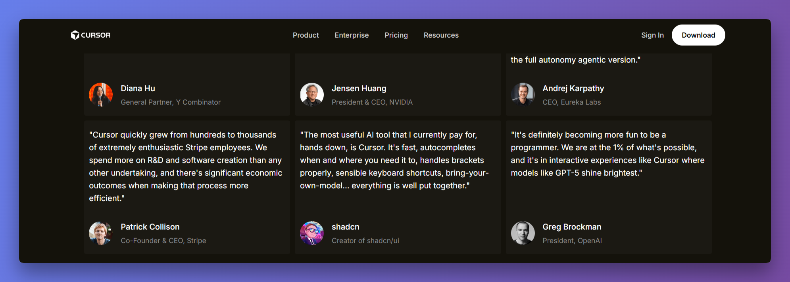
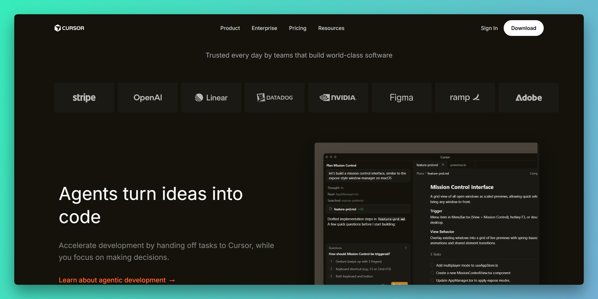

# Cursor Landing Page Recreation

A pixel-perfect recreation of the Cursor.com landing page using pure HTML and CSS

## Sections Recreated

### 1. **Top Navigation Bar**

### 2. **Hero Section**

### 3. **Trusted By / Logo Section**

### 4. **Feature Sections (3 blocks)**

### 5. **Feature Cards Section**

### 6. **Testimonials**

### 7. **Use Cases / Stories**

### 8. **Changelog / Updates**

### 9. **Team / About**

### 10. **Footer**

## Technical Implementation

### HTML Structure
- Semantic HTML5 elements (`<nav>`, `<section>`, `<footer>`)
- Proper heading hierarchy (h1, h2, h3, h4)
- Accessible markup with meaningful class names
- No inline styles

## 🚀 How to View

### Local Viewing
1. Clone or download this repository
2. Open `cursor-landing.html` in any modern web browser
3. No build process or server required

### GitHub Pages (Recommended)
1. Push to a public GitHub repository
2. Go to Settings > Pages
3. Select main branch as source
4. live at: `https://mudassir-jmi.github.io/cursor-landing-page/`

## 📸 Screenshots

## 🔗 References

- Original Website: [https://cursor.com](https://cursor.com)
- Brand Assets: [https://brandfetch.com/cursor.com](https://brandfetch.com/cursor.com)

---
